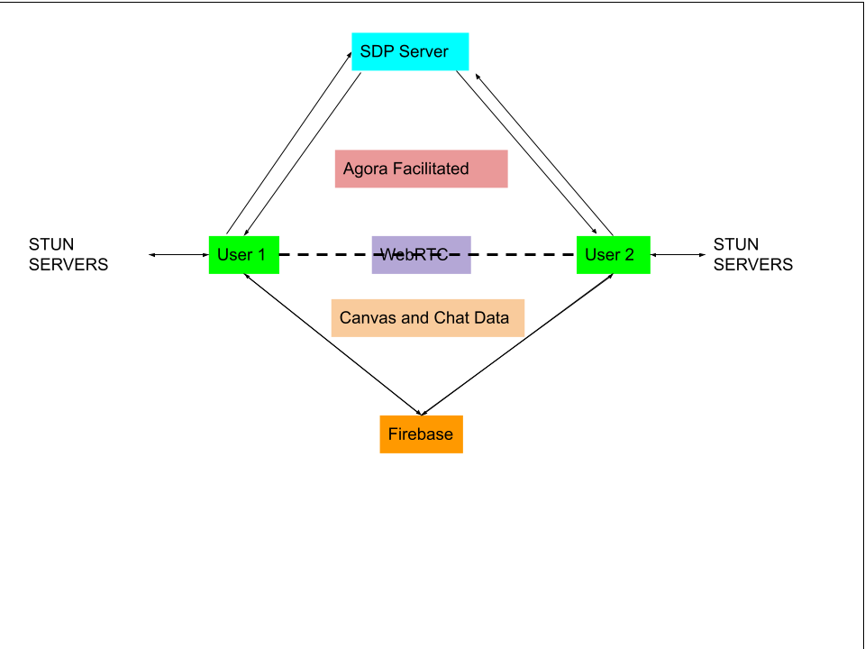

# Boom

_Gather your friends (or your enemies) for a battle of illustrative dominance!_

Boom is a web based application that brings you multi-peer video conferencing, real-time chatting, and pictionary.
Try it [here!](https://boomcaptain.netlify.app/)


# Developement

Boom was developed by Andrea Tran, Blake Lein and West McMillen in September 2022. Read more about the making of this app on [Medium](https://medium.com/@eyyytran/nurse-to-tech-in-16-weeks-our-capstone-project-ecf336dae079)




## Technologies

-   JavaScript
-   TypeScript
-   React
-   Reat Router
-   Redux
-   Redux Presist
-   Tailwindcss
-   Firebase
-   Agora

## Dependencies

-   @fortawesome/fontawesome-svg-core: "^6.1.2",
-   @fortawesome/free-brands-svg-icons: "^6.2.0",
-   @fortawesome/free-solid-svg-icons: "^6.1.2",
-   @fortawesome/react-fontawesome: "^0.2.0",
-   @reduxjs/toolkit: "^1.8.5",
-   @types/node: "^16.11.56",
-   @types/react: "^18.0.17",
-   @types/react-dom: "^18.0.6",
-   @types/react-fontawesome: "^1.6.5",
-   @types/react-redux: "^7.1.24",
-   @types/redux-logger: "^3.0.9",
-   @types/redux-persist: "^4.3.1",
-   agora-rtc-react: "github:AgoraIO-Community/agora-rtc-react#v1.0.1",
-   dotenv: "^16.0.1",
-   firebase: "^9.9.4",
-   react: "^18.2.0",
-   react-dom: "^18.2.0",
-   react-redux: "^8.0.2",
-   react-router-dom: "^6.3.0",
-   react-scripts: "5.0.1",
-   redux-logger: "^3.0.6",
-   redux-persist: "^6.0.0",
-   typescript: "^4.7.4",
-   uuid: "^9.0.0"

## GitHub Repository

https://github.com/westmcmillen/fourSquare

# How To Install

```
npm install boom
```

In order to run app, you will need your own config.js file with your firebase config. You will also need your own Agora project Id to render video.
